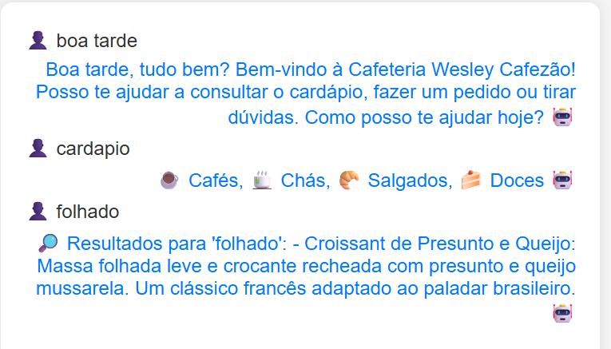

# ChatBot - Cafeteria

Esse projeto consiste na criação de um ChatBot para disciplina de Sistemas Otimizados para Web do curso de Pós-Graduação do IFBA/Vitória da Conquista.
Nesse projeto foi utilizado as bibliotecas nltk e chatterbot, ambos no Pyhton.
Demais bibliotecas estão especificadas no requirements.txt.

## Funcionamento
Quando o usuário envia uma mensagem, o bot deve ser capaz de responder, lembrando que a função dessa atividade é apenas demonstrar o funcionamento do Bot.

## Coleta de dados
Saudação Inicial

Consulta de cardápio

 
Mineração de dados em fonte interna

Pedido

Funcionamento

### O projeto
A intenção do projeto não é fazer tratativa de negócios ou regras de requisição, mas apenas demonstrar o funcionamento das bibliotecas citadas.
A base de conhecimento para essa atividade está na pasta base_conhecimento na raiz do projeto.
Foi utilizado ChatGPT para criação da base de conhecimento.
O frontend usado foi disponibilizado pelo professor da disciplina.
